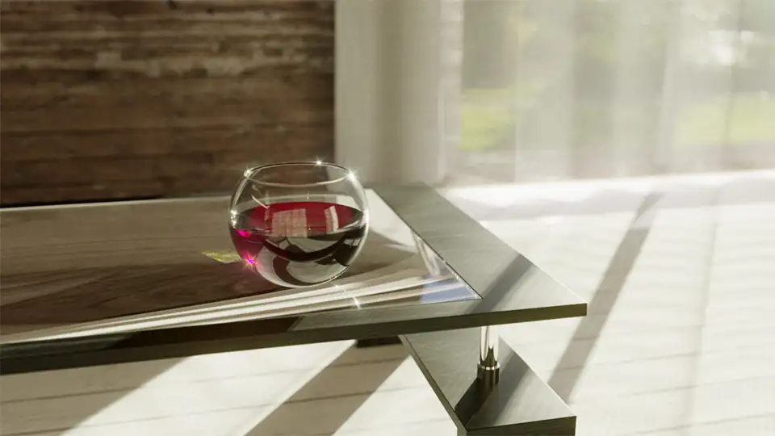
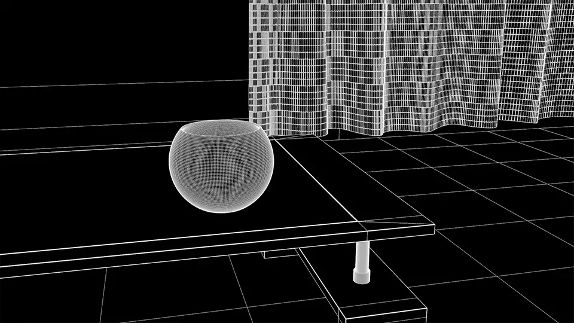
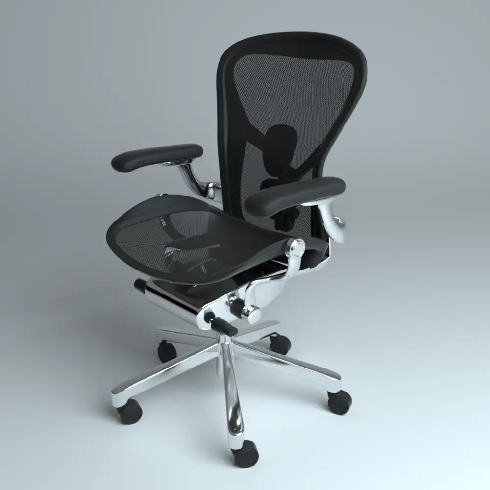
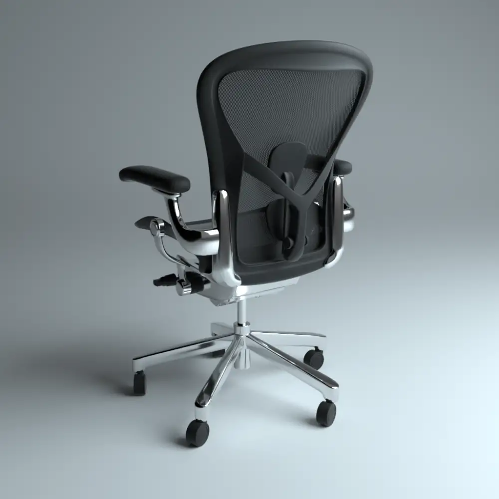
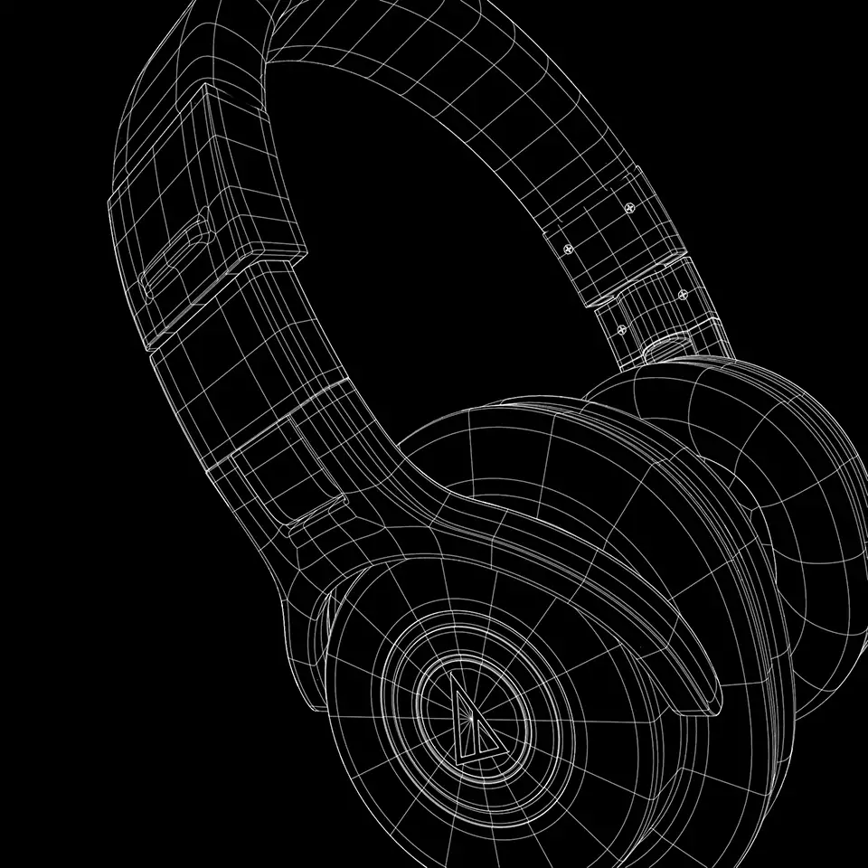
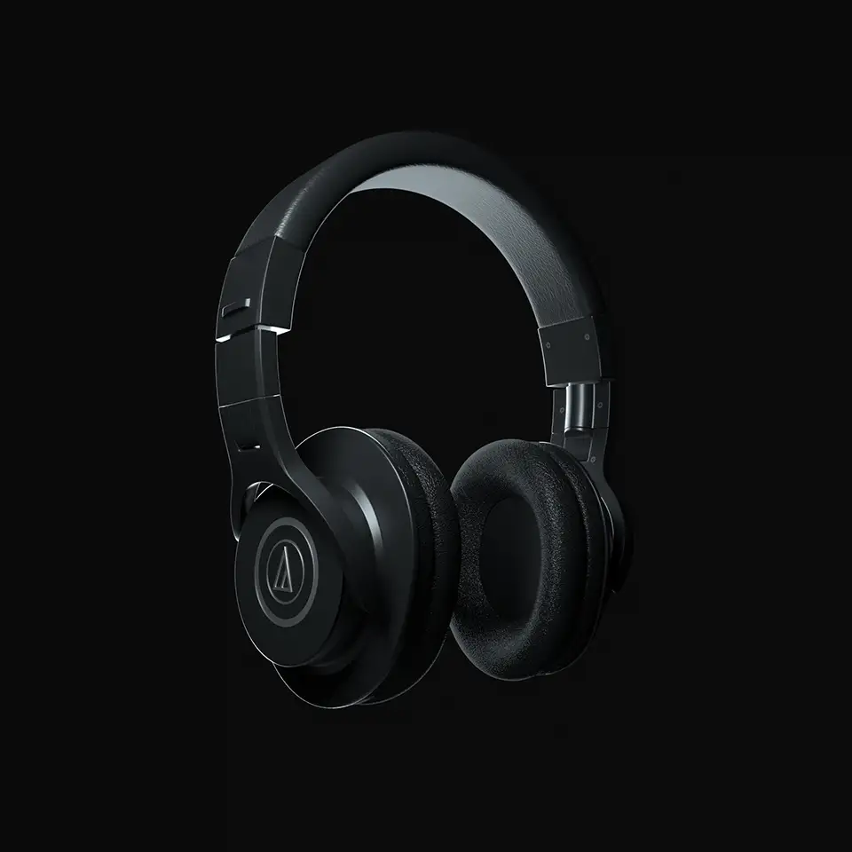

2018年に作ったCGまとめです。モデリングなどはCinema 4Dで、レンダリングはCorona RendererやOctane Renderを利用しました。

## Glass

グラスをレンダリングしてみました。カーテンの影が一番お気に入りです。

## Aeron chair

CGでアーロンチェアを作ってみました。IBLに頼らず、一点照明+黒レフのみで自然な画を出せないかを検討しました。

## ATH-M40x

CGでヘッドフォンを作ってみました。プロダクト系のCGなので、エッジにハイライト入れたり、リムライト置いたりして遊びました。

