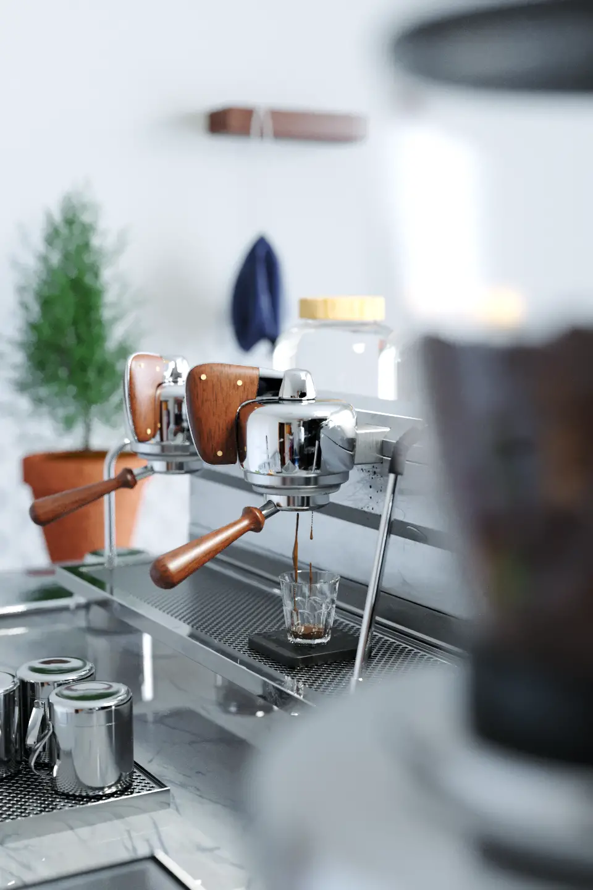

CG まとめです。モデリングなどは Cinema 4D で、レンダリングは Corona Renderer や Octane Render を利用しました。

## Glass

グラスをレンダリングしてみました。カーテンの影が一番お気に入りです。

## Aeron chair

CG でアーロンチェアを作ってみました。IBL に頼らず、一点照明+黒レフのみで自然な画を出せないかを検討しました。

## ATH-M40x

CG でヘッドフォンを作ってみました。プロダクト系の CG なので、エッジにハイライト入れたり、リムライト置いたりして遊びました。

## Coffee maker

CG でコーヒーメーカーを作りました。ぶっ刺しを避けながら、トポロジーを綺麗に保つようにモデリングしてみました。

