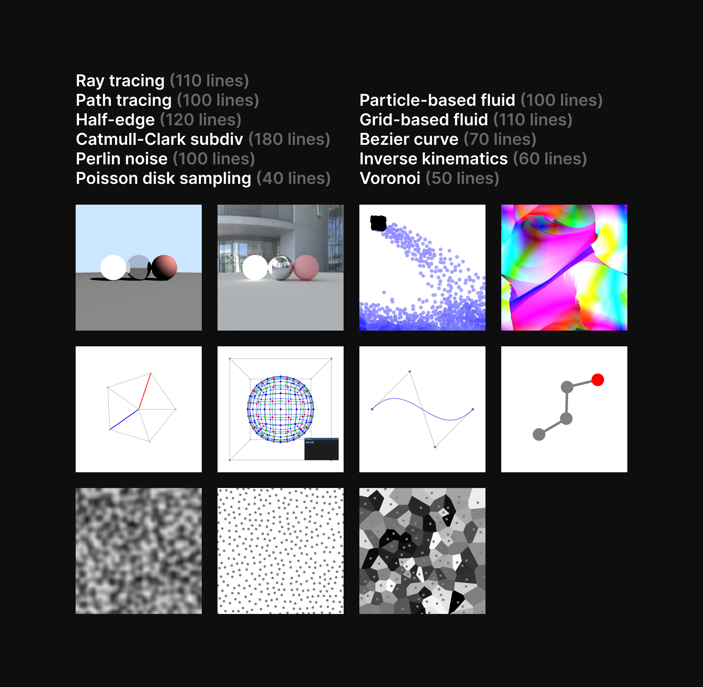

100行程度のコードでCGの超有名アルゴリズムを11個実装してみました。Pythonなのでシンプルかつ、ほとんどGPUで実装してるので高速です。

GitHub: [yknishidate/GP100L](https://github.com/yknishidate/GP100L)

- Ray tracing (110 lines)
- Path tracing (100 lines)
- Particle-based fluid (100 lines)
- Grid-based fluid (110 lines)
- Half-edge (120 lines)
- Catmull-Clark subdivision (180 lines)
- Bezier curve (70 lines)
- Perlin noise (100 lines)
- Poisson disk sampling (40 lines)
- Voronoi (50 lines)
- Inverse kinematics (60 lines)

