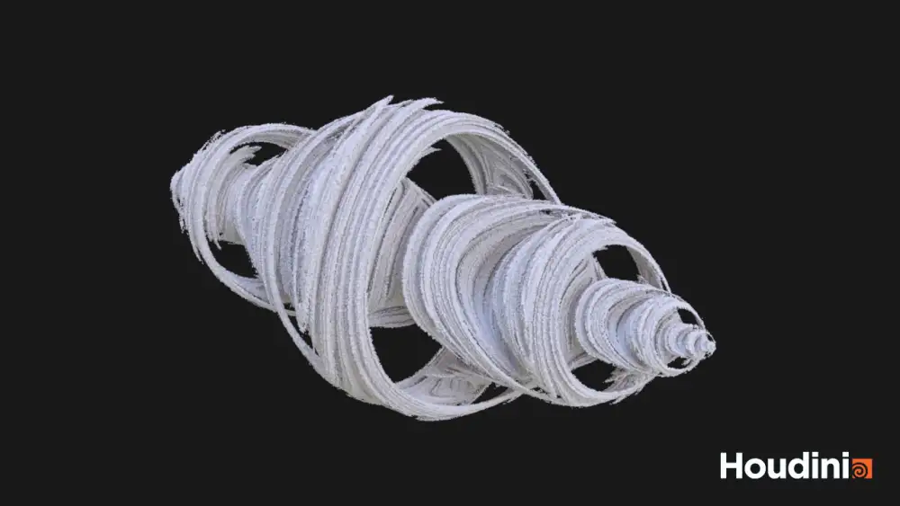

import { AspectRatio  } from "@chakra-ui/react";

Houdiniの練習でいくつか作品を作ってみました。

## Fractal

四元数によってジュリア集合を拡張し、ボリューム可視化してみました。

## Maze

Houdiniで穴掘り法による迷路の自動生成を行い、さらにその迷路の最短経路探索を実装してみました。

<AspectRatio w="100%" ratio={16 / 9}>
  <iframe
    title=""
    src="https://www.youtube.com/embed/u9zstsFlBdw"
    allowFullScreen
  ></iframe>
</AspectRatio>

<AspectRatio w="100%" ratio={16 / 9}>
  <iframe
    title=""
    src="https://www.youtube.com/embed/FZBWvUZFv0s"
    allowFullScreen
  ></iframe>
</AspectRatio>

## Tesseract

Houdiniで4次元超立方体を可視化してみました。

