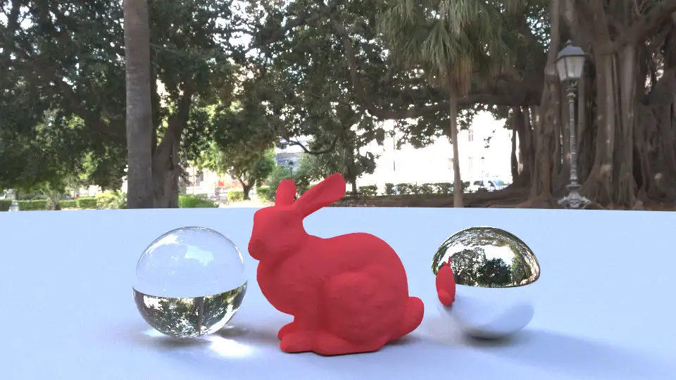
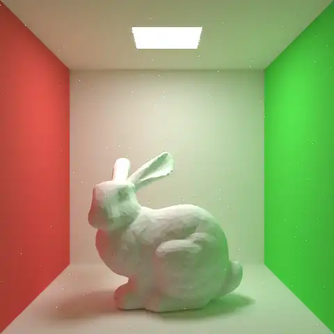
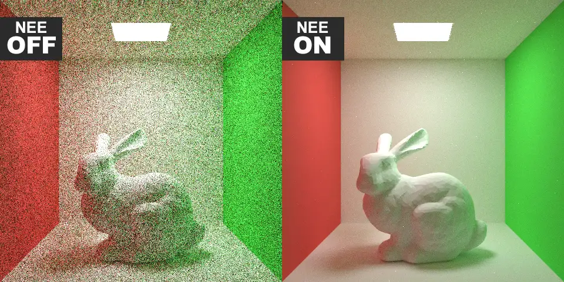

パストレーシングを理論から学び、実装してみました。環境はCPUです。

## BVH + IBL

HDRIを使ってIBL(Image Based Lighting)を行うことで、とてもリアルな画が出せました。また、メッシュの衝突判定も行っており、高速化のために簡単なBVH(Bounding Volume Hierarchy)も実装しています。

## Next Event Estimation

Next Event Estimationも実装しました。収束が早くて素晴らしいです。

