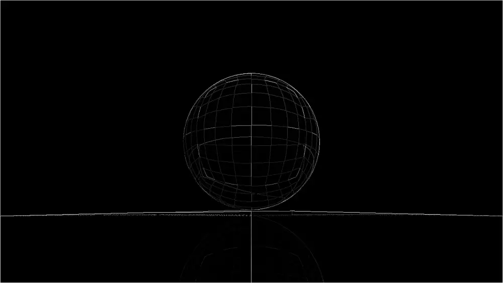
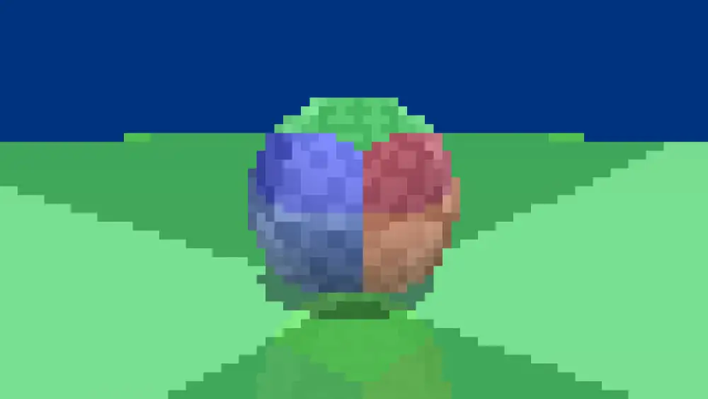

import Video from '../components/video';

## RayTracing + Physics Engine

Vulkan RayTracing Engine + Physics Engineによるエンジンを制作中です。

<Video src="https://github.com/nishidate-yuki/storage/blob/master/Desktop_2021-05-06_-_21-26-48-01.mp4?raw=true" ></Video>

## Compute shaders

Compute shaderを使って簡単な画像処理をしてみました。

### エッジ検出

### エッジのみのアンチエイリアシング

テクスチャはボヤけさせず、ジャギーを低減できます。

### モザイク

## Raytraced Soft Shadow

リアルタイムでソフトシャドウを実装してみました。

RayTracing Pipelineでハードシャドウを作成した後にCompute Pipelineで距離などに基づいたブラーを掛けています。こうすることで遮蔽物の近くではハードに、遠くに行くほどソフトになるシャドウを実現しました。

