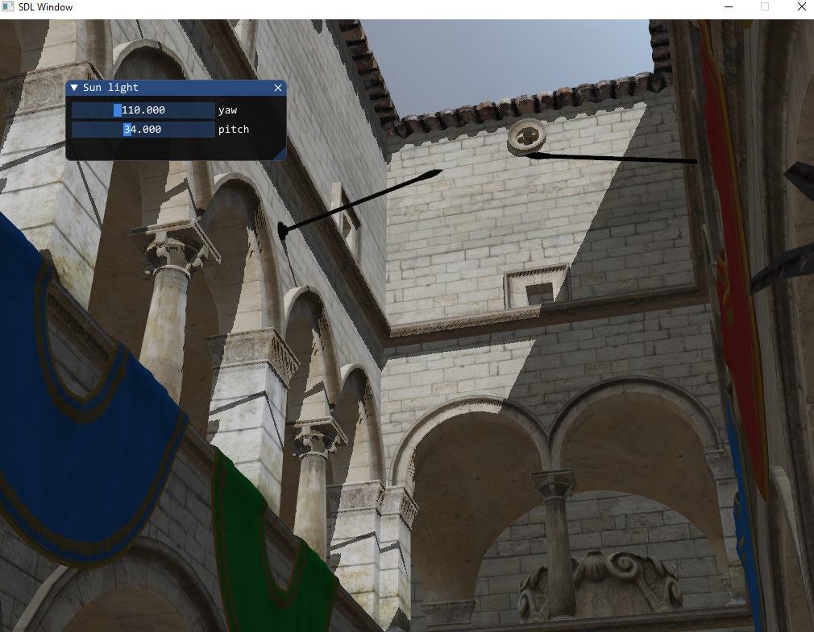

import Video from '../components/video';

GPUリアルタイムレンダリングに挑戦してみました。

## Realtime PBR

物理ベースレンダリングの理論を学び、OpenGLで実装してみました。

Split sum approximationについては何故こんな近似でいいのか分かっていません。

### Features

- HDRIからのCubemap作成
- Diffuse IBL
- Specular IBL

## Shadow Mapping

シャドウマッピングも実装してみました。実装が面倒なうえにあまり綺麗ではないので微妙です。

Cascaded Shadow Mapsとかにすれば良いのでしょうが、ちょっと面倒すぎるのでRaytrace shadowにしたいです。

