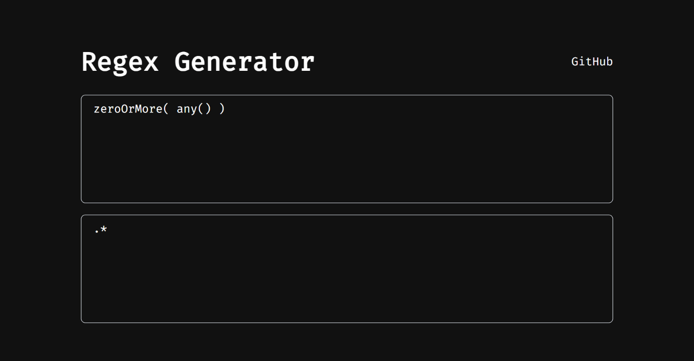

正規表現を関数で書けるサイト、[Regex Generator](https://yknishidate.github.io/regex-generator/)を作ってみました。正規表現ってすぐ忘れてしまって毎回ググるはめになるので、こういうのちょっとだけ欲しかったんですよね。

上にコードを書くと下にRegexが生成されるという簡単なアプリです。



中身の挙動は以下のような感じです。useState()でregexを持たせておいて、コードが入力されたらそれを実行し、regexにセットするだけです。

```js
export default function Home() {
  const [regex, setRegex] = useState(".*");

  return (
    <Container>
      {/* input */}
      <Textarea
        onChange={(event) => {
          const value = event.target.value;
          const result = compile(value);
          if (result) {
            setRegex(result);
          }
        }}
      ></Textarea>

      {/* output */}
      <Textarea
        value={regex}
      ></Textarea>

    </Container>
  );
}
```