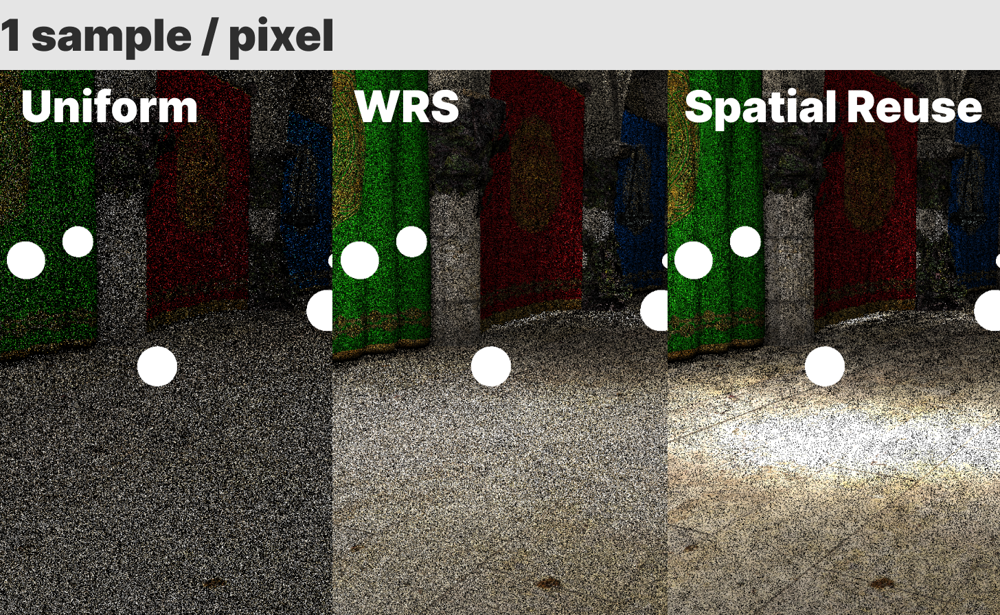
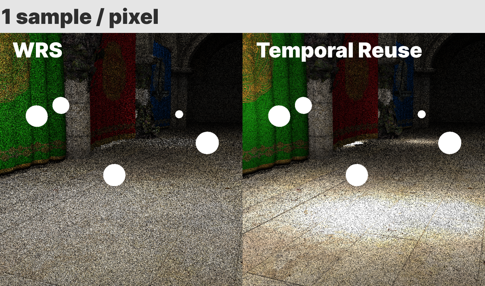

ReSTIR [[Bitterli 2020]](https://cs.dartmouth.edu/wjarosz/publications/bitterli20spatiotemporal.html) の追実装をしました。
[[GitHub]](https://github.com/yknishidate/Reactive)

実装した機能

- Weighted Reservoir Sampling
- Temporal Reuse
- Spatial Reuse

