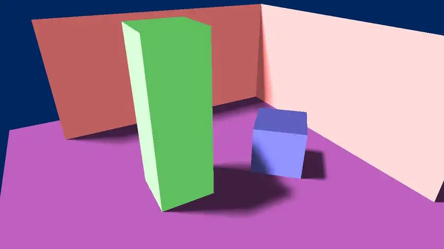
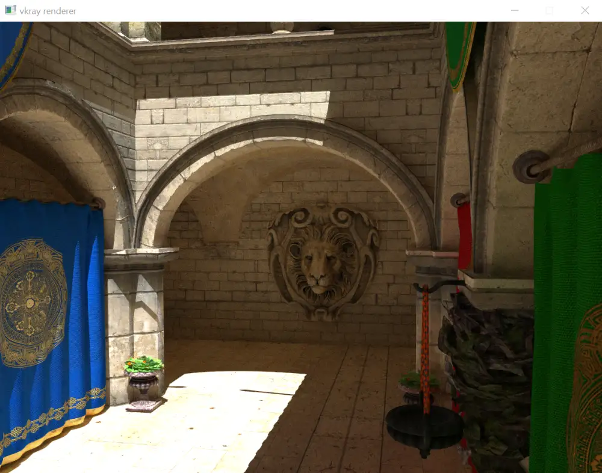
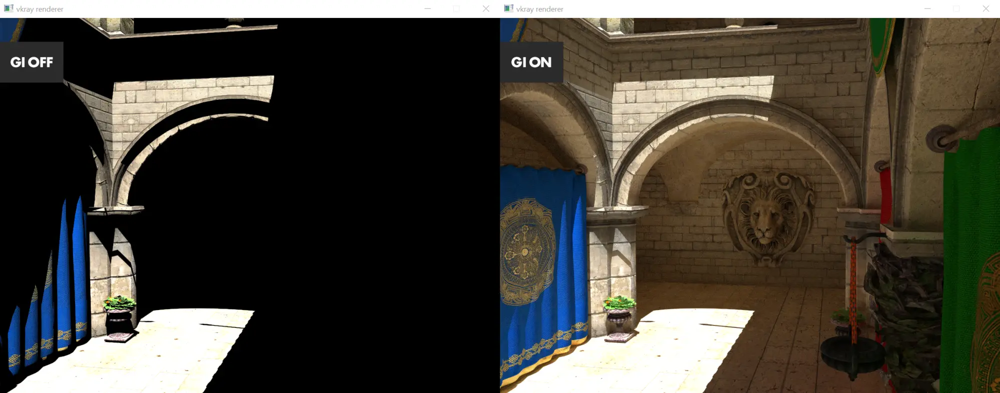
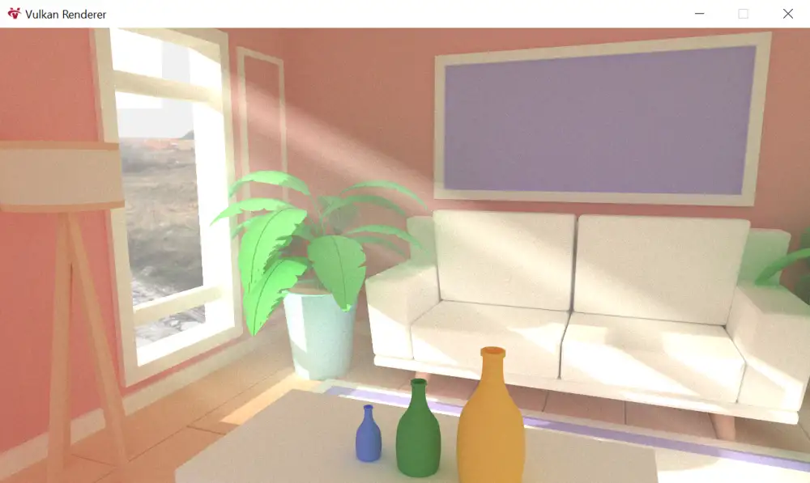
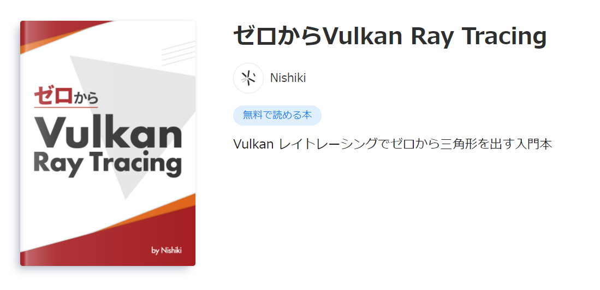

import Video from "../components/video";

## Raytraced Shadow

リアルタイムレイトレースシャドウを実装しました。コードはフルスクラッチで約 3000 行くらいです。シャドウマップに比べると実装も楽で圧倒的綺麗さなのでレイトレ最高です。

<Video src="https://github.com/yknishidate/storage/blob/master/Desktop_2021-02-10_-_00-12-19-01.mp4?raw=true"></Video>

レイ 1 本のみで実現できる簡単なソフトシャドウも実装してみました。RayTracing Pipeline でハードシャドウを作成した後に、 Compute Pipeline で遮蔽物までの距離などに基づいたブラーを掛けています。こうすることで遮蔽物の近くではハードに、遠くに行くほどソフトになるシャドウを実現しています。

## Raytraced Reflection + Physics Engine

リアルタイムレイトレースリフレクションと、簡単な物理演算を組み合わせてみました。
物理演算は簡単な形状しかサポートしていませんが、角速度や摩擦、連続的衝突判定、広域/狭域の二段階衝突判定などを実装しています。

<Video src="https://github.com/yknishidate/storage/blob/master/Desktop_2021-05-06_-_21-26-48-01.mp4?raw=true"></Video>

## Path tracing

リアルタイムではないですが、シンプルなパストレーシングも実装しました。

プログラム的には `maxDepth` を `1` にすればダイレクトライティングのみ、 `2` 以上にすると GI を考慮するようにしています。

今回は高速化のために直接光が当たった時点で寄与十分としてトレースを打ち切っています。かなり雑ですが、ある程度の画は出ます。

## Pathtraced Volumetric Fog

Volumetric Fog を実装しました。レイを飛ばす途中でランダムに散乱させることで実現しています。仮想面積を持たせた太陽と IBL を共存させた上で NEE の考え方を導入し、実装の単純化、高速化、リアリティの向上を図りました。

## 「ゼロから Vulkan Ray Tracing」

「[ゼロから Vulkan Ray Tracing](https://zenn.dev/nishiki/books/f468197dca2dd8)」という入門書を書きました。

